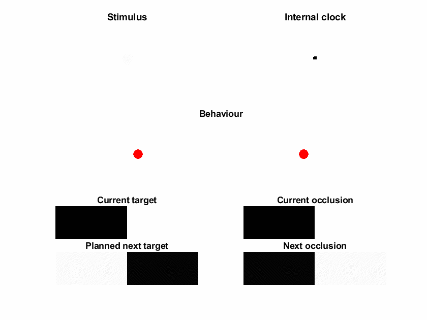

# Computational Neurology

This repository deals with computational models with relevance to neurological syndromes. 

#### Contents
1. Internal clocks
2.  

#### Appendices
1. Active Filtering
2. Related models

## 1 - Internal clocks
The simulations developed in the DEMO_Metronomes.m routine are designed to show how we might make use of internal clocks (or metronomes) to synchronise our behaviour to events in the world. This is of particular relevance for conditions such as Parkinson's disease or Lewy Body Dementia in which everything from movement to thought can be slowed. In such conditions, a particularly interesting phenomena observed is that of kinesia paradoxica, in which certain environmental stimuli can be used to generate much more fluid movement

The theoretical background for this work depends upon ideas about chunking of continuous events into ...

In what follows, we illustrate the 'healthy' simulation under several different conditions (changing only the input stimulus but not the model) in sections 1.1-1.3. Following this, we consider what happens when we 'lesion' the model, by changing prior beliefs. We then consider the relationship between aspects of the model and neurobiology (including both the relationship between computational architecture and anatomy and the role of electrophysiological observations - including 'beta bursts' - in supporting healthy motor cognition), and finish by evaluating the potential to recover parameters from this model through fitting to behavioural data. 

### 1.1 - Simulation under default settings
The simulation presented here shows...

### 1.2 - Simulation with faster stimulus presentation
The simulation presented here shows...

### 1.3 - Simulation with occlusions
The simulation presented here shows...

### 1.4 - Simulation with attenuated policy precision
The simulation presented here shows...

### 1.5 - Simulation with impaired segregation of preparation and execution phases
The simulation presented here shows...

## 2. 

## A1 - Active Filtering

## A2 - Related Models
